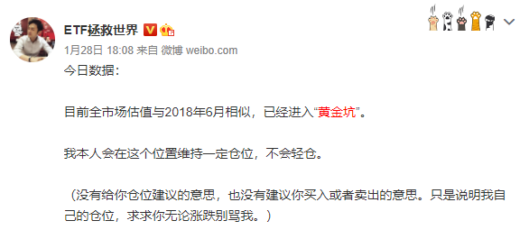

https://mp.weixin.qq.com/s/17XDfl9FAmW23sTfMmtZ4w

**前言**

E大微博说市场又进入「**黄金坑**」了。

E大的「两大坑」而驰名已久，当然这里的「坑」是好坑，不是坑人哈。除了「黄金坑」，另一个是「钻石坑」。如后续E大有谈及「**钻石坑**」，我们再一起研究。

# 什么是黄金坑

E大提及黄金坑，邮件，黄金坑提及9次，微博15次。

虽然出现频率不高，但每次出现都是激动人心的时刻。因为一般出现，意味**接下来有肉吃了**。

E大投资宇宙中，所谓的「黄金坑」就是股市下跌出来的巨坑，坑里遍地黄金。

他在2018年9月26日微博说：

这样五年一遇的大底部，真的是咱们**积攒廉价筹码**的黄金坑。这一次出去后，下次就要等很多年了。当然，这次还要多久出去还不知道。

但这不重要。就是现在能让咱们买这些便宜货，就谢天谢地谢人了。

ETF拯救世界，微博

谢天谢地的是，这周又进入了「黄金坑」。让原来跟不上E大车的新人，**存在跟上车的可能**。

为何说可能呢？因为谁也不知道「黄金坑」会停留多久，有可能摸一把就跑了，也可能接下来更激烈，直接到「钻石坑」呢？

# **怎么算进黄金坑**

E大定义的「黄金坑」是：

**全市场PE进入30倍以内，**一般PB是2左右。这里没有固定公式，需结合市场情况。

很多人奇怪，为何上证都新高了，还说现在进入「黄金坑」。这个E大在微博也解释了：

2018年6月至今，可比的3495只股票中，上涨的是1643只，比例为47%。也就是说，**指数从2847涨到3505，实际上超过一半（53%）的股票是下跌的**。即使不算业绩上涨因素，全市场估值又回去了也非常正常。

**今年上涨比例为23.77%，涨幅中位数是-7.09，最惨股票已经跌了58.68%。**

ETF拯救世界，微博

就是前段时间很多人一直喊的：**指数涨，自己亏**。

# **黄金坑怎么抄底**

你怎么知道「黄金坑」就是底。只能说这个位置捡的筹码比较便宜，长期看赚的概率更大。但**不代表不会更低**，或者**在坑底长时间震荡**。

结合上面的指数涨，自己亏的情况，意味着即便「黄金坑」里拣货，也要檫亮眼睛。

如果捡到了E大说那几个今年会**烟花表演**的，那就这个坑也就跟你没啥关系了。

建议随时留意E大的发车，过往坑里发车频繁，一般几个月就又快速出坑了。

最后以E大名句作为结尾：

**问题的关键就在于，如何让自己在低迷的几年内不死，同时收集大量廉价筹码，最终在疯狂中收获巨大的利润，最终安全离场，然后又是轮回。**