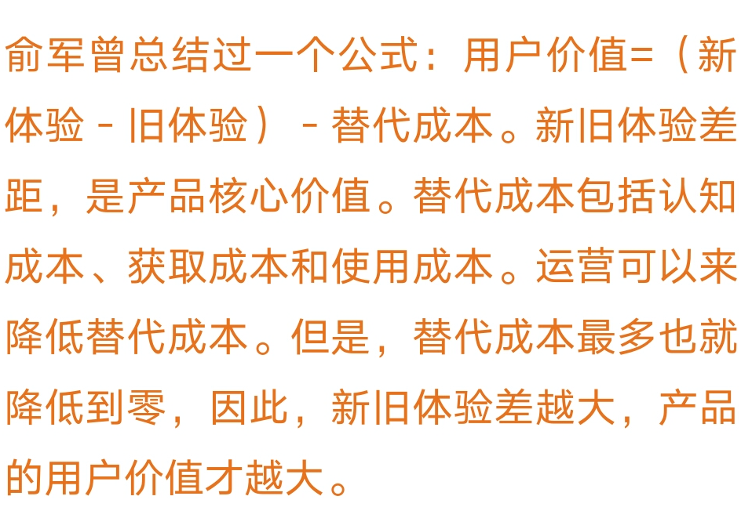
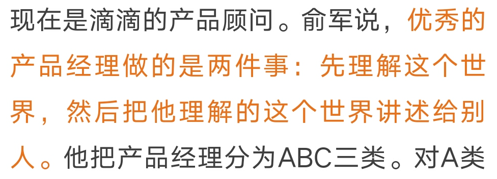
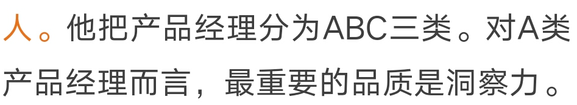
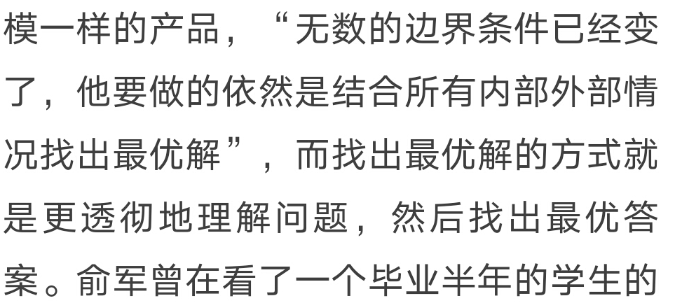
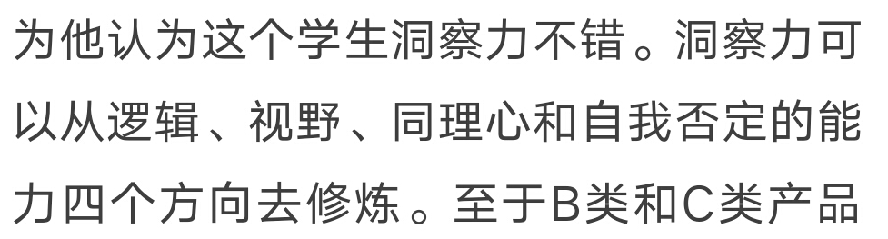

**1.什么是用户价值**

用户价值 = （新体验-旧体验）-替代成本

新体验-旧体验 是整个产品形态的用户价值

替代成本，是指新体验替代就体验的成本

所以用户价值，还需要减去替代成本。

也就是说替代成本越高，你的产品价值就越底。新产品创造出来的体验价值，会被替代价值吃掉。

所以，任何产品，如果他的替代成本越高，那也就越不可替代。

这也是为什么在成熟的发达国家，电子支付这么难推的原因。不是没有价值，而是替代成本实在太高了

**2.产品经理的核心工作**

**3.产品经理的分级**

**顶级产品经理，需要洞察力。**

**洞察力可以从4个方向磨练：**

- **逻辑**
- **视野 开火的视野才能看到更多的机会**
- **同理心 揣摩用户**
- **自我否定 不停打磨出更好的产品**

