# 2019

## 2018-12-27

 *2018-12-27*-2019年1月ETF计划（一）：买入三份

https://mp.weixin.qq.com/s/J37XMWDxhHhzLgKvy7-ilg

#### 150计划：

买入养老产业 一份

（场外000968）

 （该品种自现价预计最大跌幅20%）

买入中证红利增强一份

（场外100032）

 （该品种自现价预计最大跌幅18%）

买入华宝油气一份

（场内、场外162411）

 （该品种自现价预计最大跌幅45%）

#### S计划：

买入养老产业 一份

（场外000968）

 （该品种自现价预计最大跌幅20%）

一半结余资金

买入华宝油气一份

（场内、场外162411）

 （该品种自现价预计最大跌幅45%）

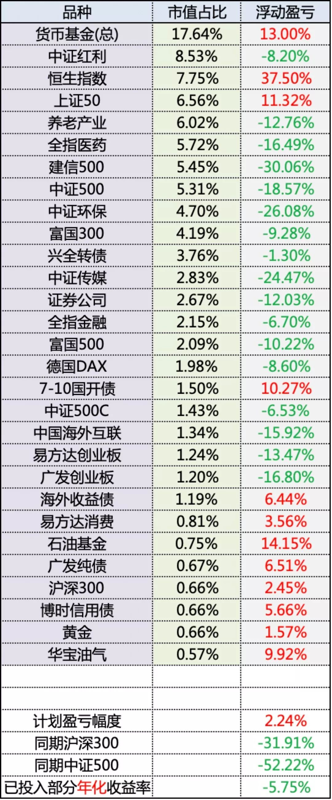

## 01-15

[2019-01-15_2019年1月ETF计划（二）：买入一份，卖出两份](https://mp.weixin.qq.com/s?__biz=MzIwMTIzNDMwNA==&mid=2653409044&idx=1&sn=7fbf416d95f9c2a850e4b9bad8d8aca9&chksm=8d226dfbba55e4ed094e4bc0f480b785ca4ef9468603ffd6aa9168c9c63e5285d6ce6eccb388&scene=27#wechat_redirect)

#### 150计划：

买入长信可转债一份

（场外519977）

 （该品种自目前价格预计最大跌幅20%）

卖出美元债一份

（场外001061）

卖出7-10国开债一份

（场外003376）

#### S计划：

买入恒生指数一份

（场内159920 或 场外000071）

 （该品种自目前价格预计最大跌幅35%）

买入广发医药一份

（场内159938或场外001180）

 （该品种自目前价格预计最大跌幅15%）

## 01-31

### 

[2019-01-31_2019年2月ETF计划（一）：买入两份](https://mp.weixin.qq.com/s?__biz=MzIwMTIzNDMwNA==&mid=2653409055&idx=1&sn=e8dbf410b789d4e54dc2ab7ad206fdf0&chksm=8d226df0ba55e4e61f7415c9530ec092801850818e86e49f3878c09f6c3e9d195aadace2cc94&scene=27#wechat_redirect)

#### 150计划：

买入富国300增强一份

（场外100038）

 （该品种预计自现价最大跌幅18%）

买入易方达安心回报债一份

（场外110027）

 （该品种预计自现价最大跌幅20%）

#### S计划：

一半资金

买入中证红利增强一份

（场外100032）

 （该品种预计自现价最大跌幅25%）

另一半资金

买入中国海外互联一份

（场内513050或场外164906）（品种预计自现价最大跌幅38%）

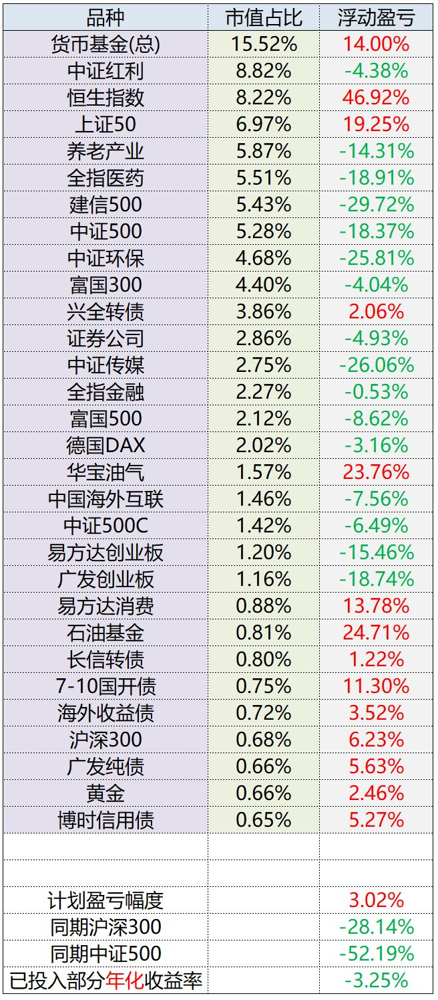 

## 02-28

[2019年3月ETF计划（一）：150不交易，S买入一份](https://mp.weixin.qq.com/s?__biz=MzIwMTIzNDMwNA==&mid=2653409101&idx=1&sn=34569296b916529effc7ba61703b8e6d&chksm=8d226da2ba55e4b4c96e49f21c3b61fcffa081d13927f325f99f069b37a380799fce2fd2dfbf&scene=27#wechat_redirect)

https://mp.weixin.qq.com/s/3Bs0AuY2HfTrKDS8DOrbrA

#### 150计划：

本次不操作

#### S计划：

一半资金

买入德国DAX30一份

（场外000614）

 （该品种自目前价格预计最大跌幅35%）

（场内成交量小，建议申购场外）

另一半备用

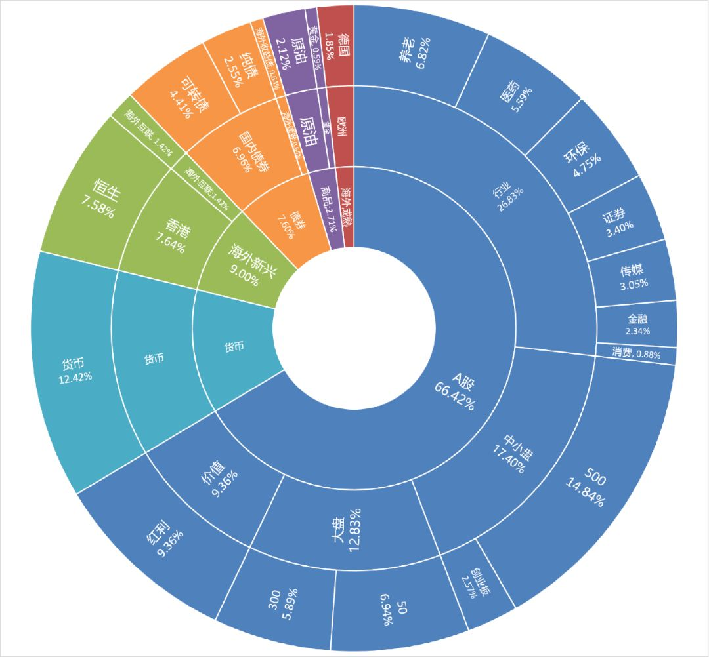

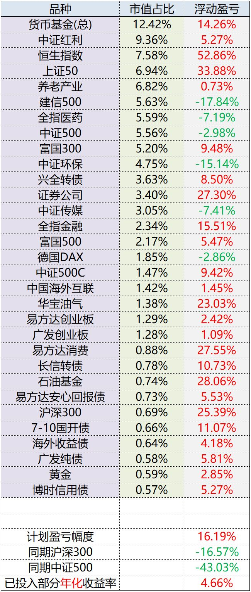

## 03-07

2019-03-07 【文字发车】

#### 150计划：

"各位好友：
临时发车一次，卖出计划持仓中2018年10月11日买的“中证500C”一份（场内510510或510500；场外C类002903）。

没有太多说的，波段仓位，持仓4个月，收益率23%，年化超过60%。满意。
卖出的原则：卖出10月11日买入时候的份额。且慢会自动计算应卖出多少份额。
低买高卖，投资就是这么简单。多大点事儿，踏踏实实的。

只是很可惜在计划里没法进行更多的类似波段或者趋势操作，否则各位的收益率还可以提高不少。
加油，祝今天心情好。"

## 03-28

[2019-03-28_2019年4月ETF计划（一）：买入两份](https://mp.weixin.qq.com/s/8QEC5GKEfzKPJjkPWKlV7g)

#### 150计划：

买入华宝油气一份

（场内、场外162411）

 （该品种预计最大跌幅55%）

买入德国DAX30一份

（场内513030 或 场外000614）

 （该品种自目前价格预计最大跌幅35%）

#### S计划：

买入黄金一份

（场内518880；场外000216）

（该品种目前价格买入预计最大跌幅55%）

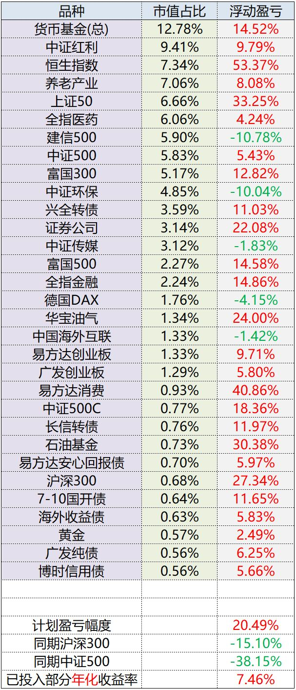

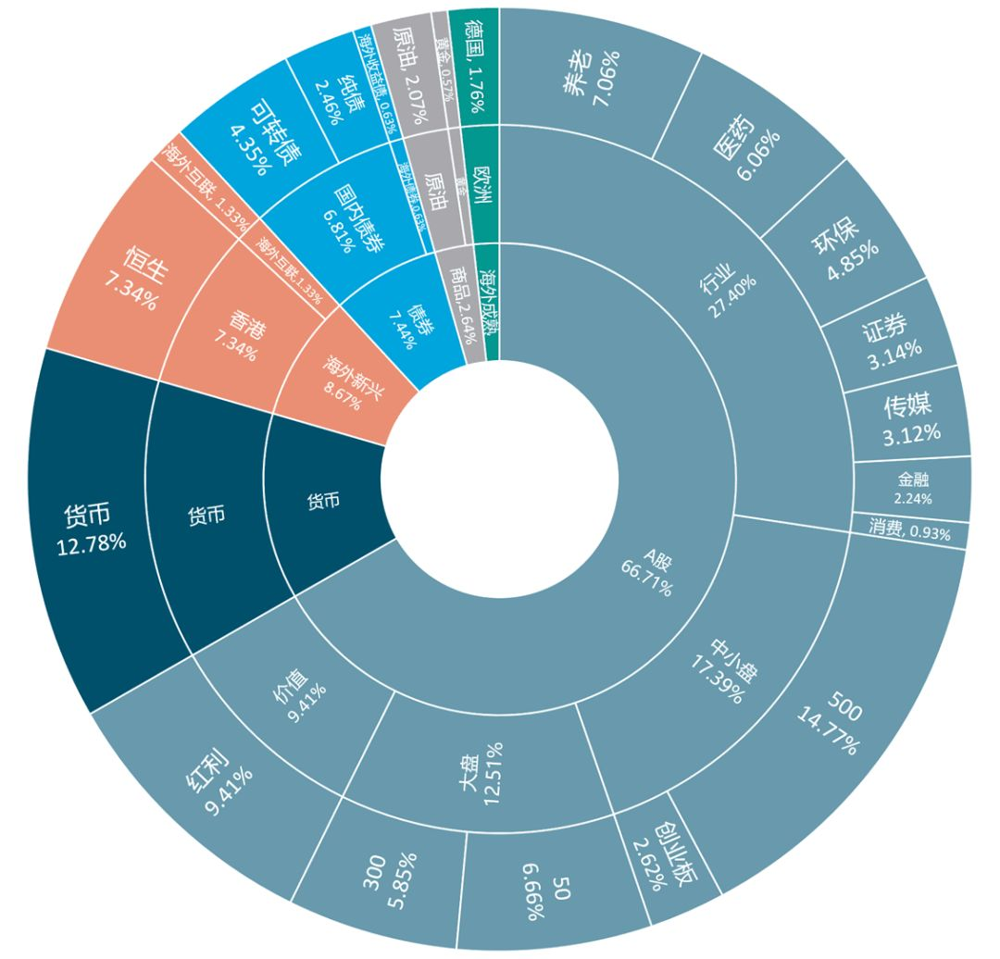

## 04-26

[2019-04-26_2019年5月ETF计划（一）：买入一份](https://mp.weixin.qq.com/s/1tE7C0MJTXLowvrIRrWUsQ)

#### 150计划：

买入中证传媒一份

（场内512980或场外004752）

 （该品种自目前价格预计最大跌幅40%）

#### S计划：

买入中证传媒一份

（场内512980或场外004752）

 （该品种自目前价格预计最大跌幅40%）

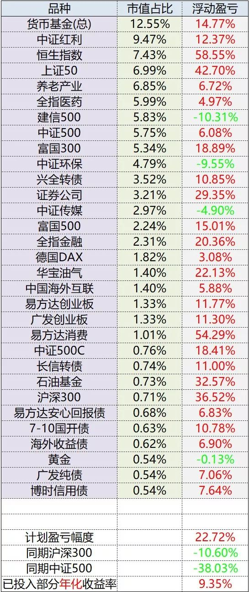

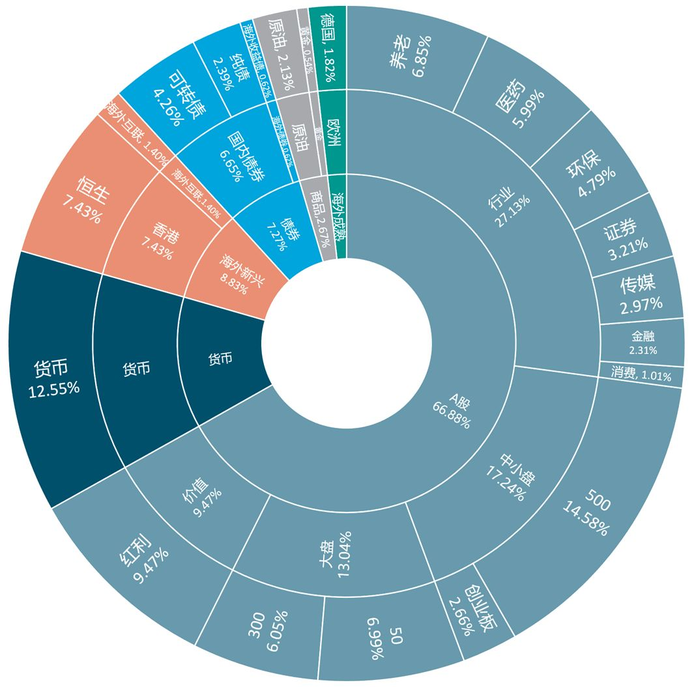

## 05-15

[2019-05-15_2019年5月ETF计划（二）：买入两份；卖出一份](https://mp.weixin.qq.com/s/Abc5-nwdQFJoPwH1pFX3Rw)

#### 150计划：

买入沪深300一份

（场内510300或159919；

场外000051或110020）

 （该品种自目前价格预计最大跌幅30%）

买入易方达安心回报债一份

（场外110027）

 （该品种自目前价格预计最大跌幅25%）

卖出易方达消费行业一份

（场外110022）

#### S计划：

买入上证50指数一份

（场内510050或场外001051）

 （该品种自目前价格预计最大跌幅35%）

## 05-30

[2019-05-30_2019年6月ETF计划（一）：买入两份](https://mp.weixin.qq.com/s/XPM2EWudS8PpItcwoqhfkQ)

#### 150计划：

买入中国海外互联一份

（场内513050或场外164906）

 （该品种自目前价格预计最大跌幅30%）

买入易方达安心回报债一份

（场外110027）

 （该品种自目前价格预计最大跌幅25%）

#### S计划：

买入中国海外互联一份

（场内513050或场外164906）

 （该品种自目前价格预计最大跌幅30%）

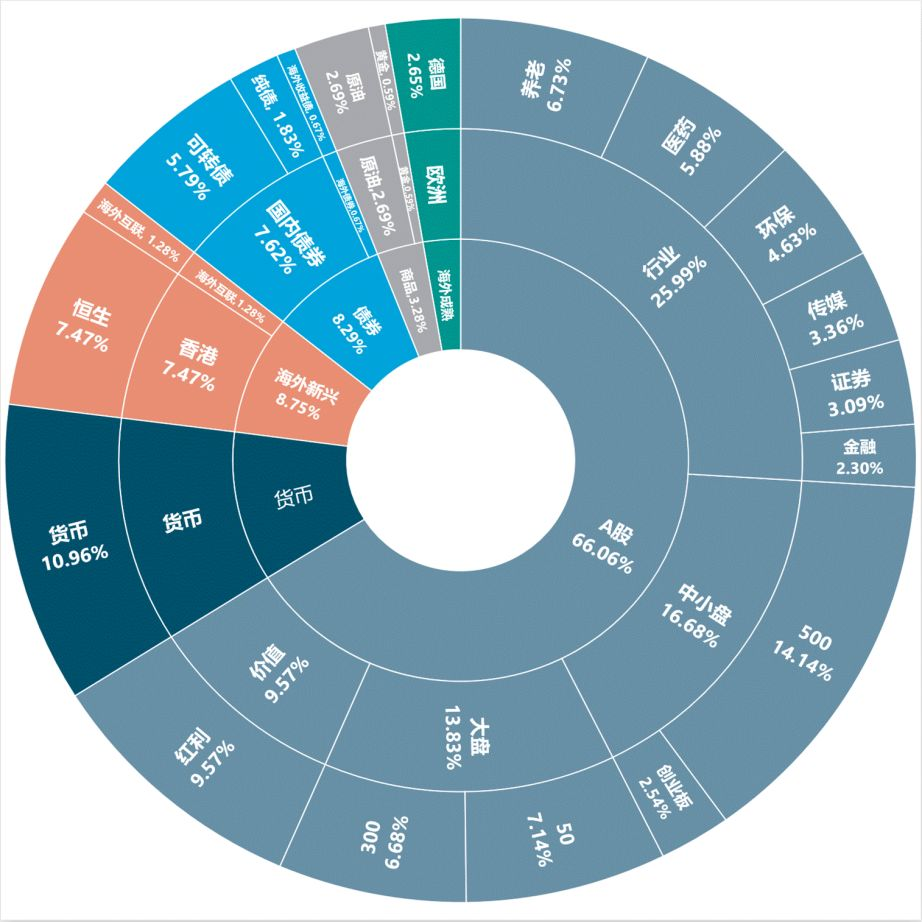

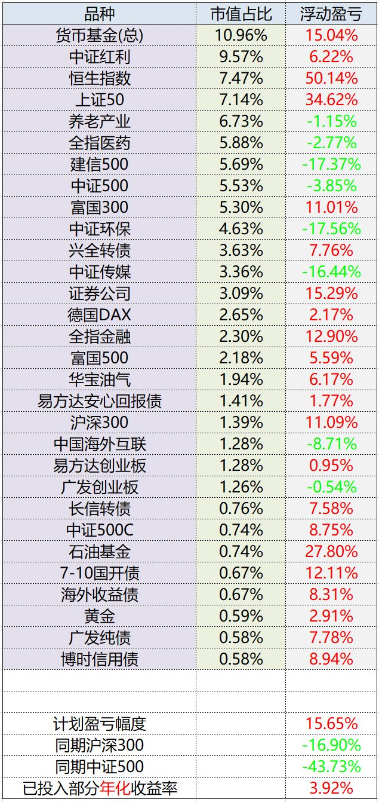

## 06-18

[2019-06-18_2019年6月ETF计划（二）：买入两份](https://mp.weixin.qq.com/s?__biz=MzIwMTIzNDMwNA==&mid=2653409211&idx=1&sn=5eba14162a721a403e226f8cab4e6834&chksm=8d226d54ba55e44272e3be87cd5e5a0a5e6b653b1fd2f74d01a60abf4c42d1948400359d12df&scene=27#wechat_redirect)

https://mp.weixin.qq.com/s/yPb-oTpCfoUF5WT3I4uXdQ

#### 150计划：

买入中证500指数一份

（场内510510或510500；

场外C类002903）

 （该品种自目前价格预计最大跌幅30%）

买入易方达安心回报债一份

（场外110027）

 （该品种自目前价格预计最大跌幅25%）

#### S计划：

买入华宝油气一份

（场内、场外162411）

 （该品种自目前价格预计最大跌幅45%）

买入建信500一份

（场外000478）

（该品种自目前价格预计最大跌幅30%）

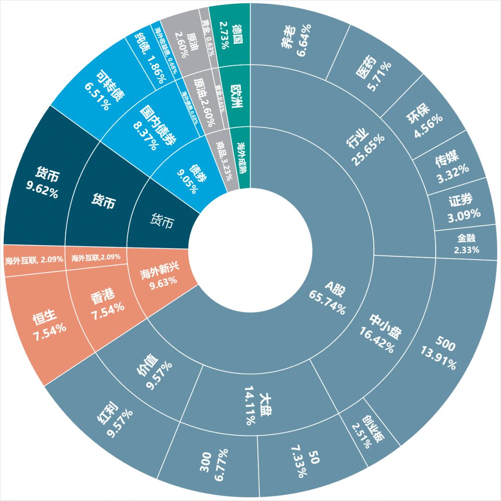

## 06-03

各位好友： 见字好。 近期我们持仓的可转债基金“兴全可转债”即将分红。目前的市场情况采用“分红再投资”方式比较合适。如果你需要更改分红方式，可以去基金销售机构更改。 分红方式在不同的环境下也应该有不同的选择，这个很难有一个简单的判断依据。未来如果还有更改的需要，我会及时提示。 天气炎热，少吃油腻，多喝水。

## 07-01

[2019-07-01_2019年7月ETF计划（一）：买入一份](https://mp.weixin.qq.com/s?__biz=MzIwMTIzNDMwNA==&mid=2653409226&idx=1&sn=7862e558ea4fbe055fd47706208a49fd&chksm=8d226d25ba55e433de728ff2f14a9eab2d7cad571a6faa82fa41779439c167f127c3f7f033ed&scene=27#wechat_redirect)

https://mp.weixin.qq.com/s/Jz7Cn3Z-g0WYPZP3H73ihA

#### 150计划：

买入黄金一份

（场内518880；场外000216）

（该品种自目前价格买入预计最大跌幅55%）

#### S计划：

买入黄金一份

（场内518880；场外000216）

（该品种自目前价格买入预计最大跌幅55%）

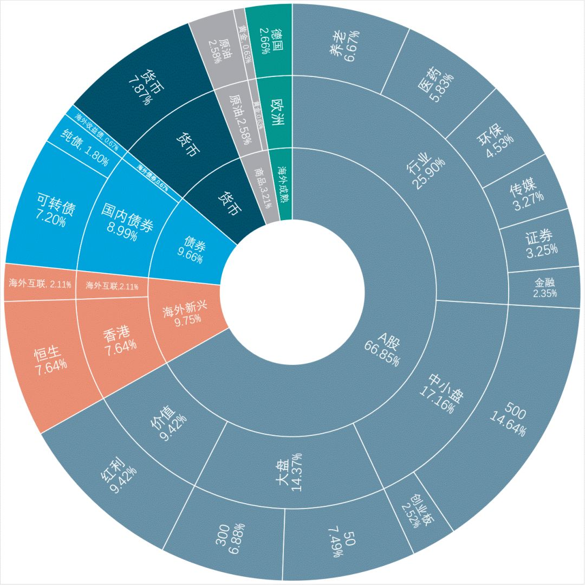

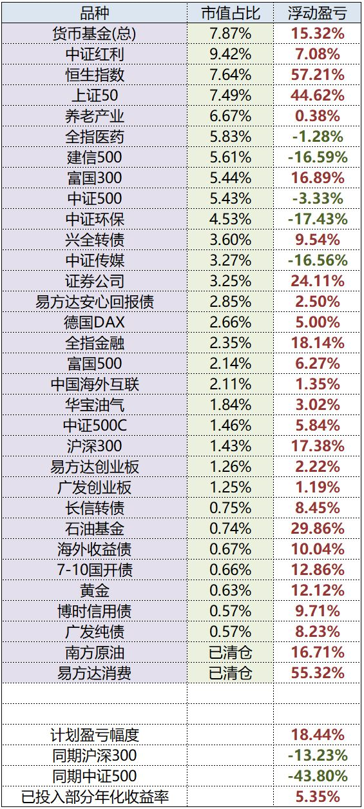

## 07-02

由于目前仓位合适，各品种仓位配置合理，本月中暂停发车一次。 昨日有急事要处理，未发送通知，希望大家海涵。 祝各位朋友今天好心情。

## 07-31

[2019-07-31_2019年8月ETF计划（一）：买入一份](https://mp.weixin.qq.com/s?__biz=MzIwMTIzNDMwNA==&mid=2653409235&idx=1&sn=4019145e0aee2f8821f9e938461cd86e&chksm=8d226d3cba55e42a0a584ee2fbe43fc708255d2c0241f0b6f007d592925afe3bb926cad6eb87&scene=27#wechat_redirect)

https://mp.weixin.qq.com/s/VZwwgE92m7lASr4YCVriyg

#### 150计划：

买入易方达安心回报债一份

（场外110027）

（该品种自目前价格买入预计最大跌幅20%）

#### S计划：

买入建信500一份

（场外000478）

（该品种自目前价格买入预计最大跌幅25%）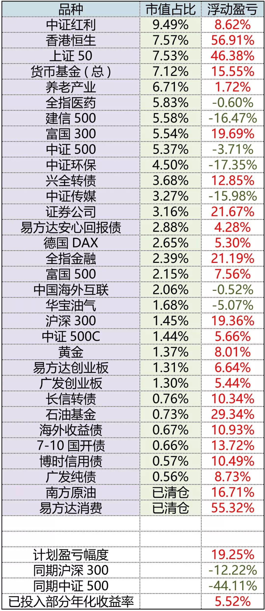

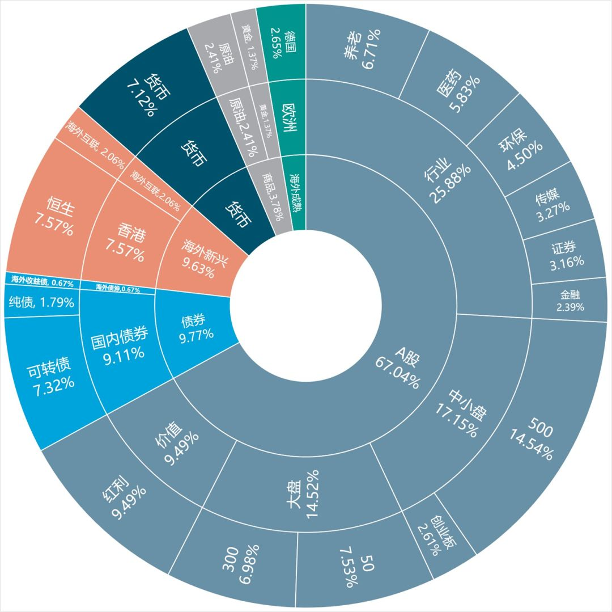

## 08-15

2019-08-15 【文字发车】
"各位好友：
见字好。

#### 150计划：

今日正值法定发车日期。计划150部分配置合适，不操作。

#### S计划：

S计划买入富国中证红利指数增强一份 (场外100032)，买入中国海外互联一份
（场内513050或场外164906）。因为我们之前已经攒了很多没有发的车，所以S这次多买一份也完全没有问题。相信你已经体会到把资金留在手里的重要性，再说一次，现金不是辣鸡。

如果之前没有依照我们建议留存S的资金，这次不买亦可。如果只可以买一份，那么优先红利。
另外，为大家制作了150和S目前的资产配置图，可以回复“1908收益率”查看。
目前各类资产除黄金外趋势全部向下，未来继续震荡或者走低各位都不应该感到惊讶。控制好仓位，逢低慢慢买入，未来会有好的收益。关于这点，相信跟车半年以上的朋友都有深刻的体会。
很多事情当时看起来很大，其实未来回头看，根本没有多大点事儿，都踏踏实实的。
好好吃饭，好好睡觉，好好锻炼身体，好好谈恋爱，顺便上个班什么的，你说生活多开心。很多时候，开心还是不开心，都是一念之间的事，大多数时候，是你自己决定的。努力改变能改变的，接受不能改变的，心情也就好了。
祝各位今天以及明天都很开心。回见！"

## 08-30

[2019-08-30_2019年9月ETF计划（一）：150不交易，S买入一份](https://mp.weixin.qq.com/s?__biz=MzIwMTIzNDMwNA==&mid=2653409246&idx=1&sn=4ccf076f57b5e392f2efa09df4850f02&chksm=8d226d31ba55e42740fad4fb8656c4258c77a075d0c15390cb4f5b9ba4814c2d993ba506c0b5&scene=27#wechat_redirect)

https://mp.weixin.qq.com/s/TnlPhElfjbM3cIqLT91z9A

#### 150计划：

本次不操作

#### S计划：

买入恒生指数一份

（场内159920 或 场外000071）

 （该品种自目前价格预计最大跌幅35%）

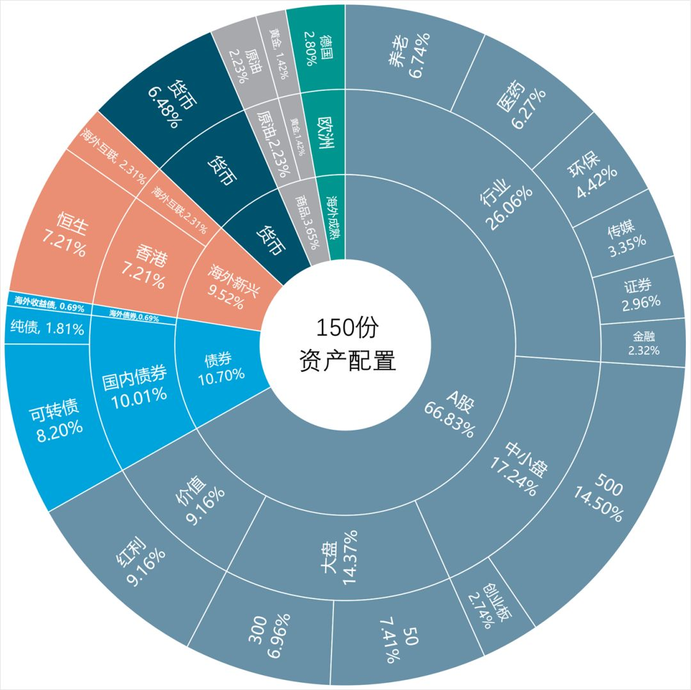

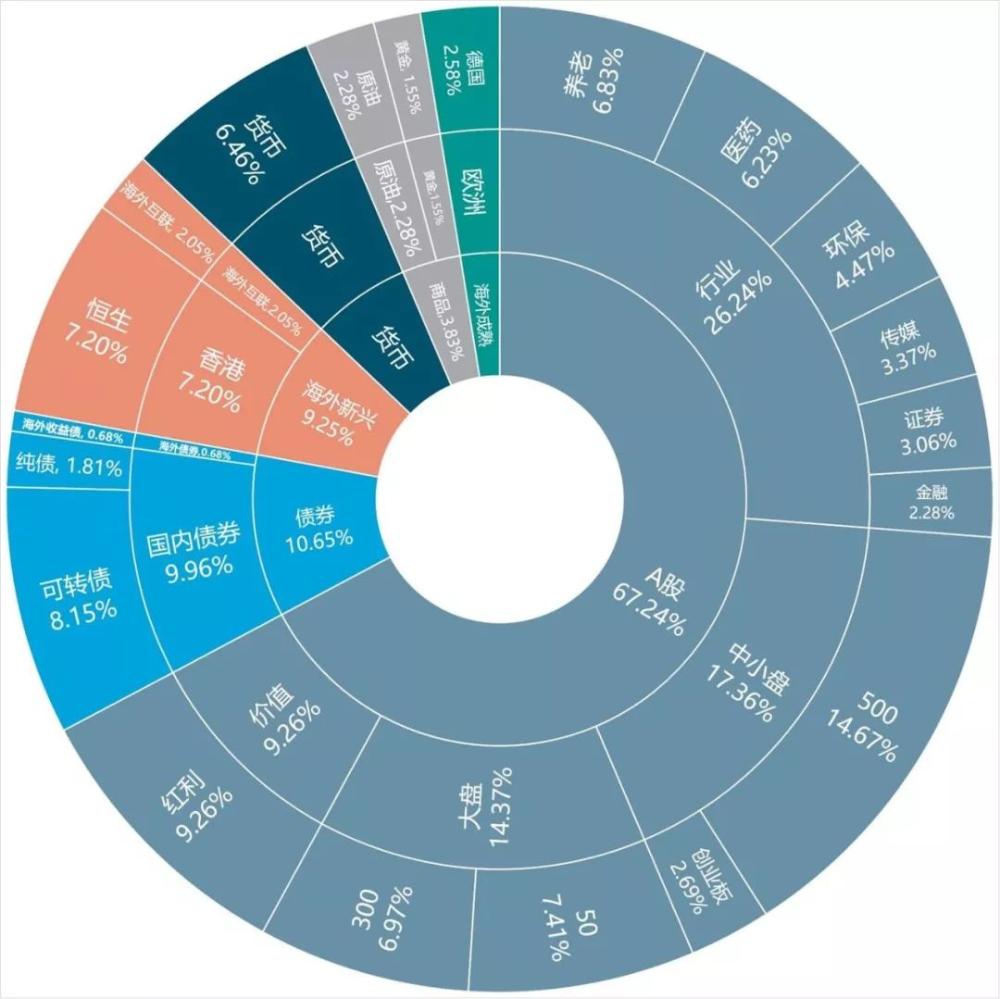

150计划收益率继续领先同期沪深300指数32%，领先中证500指数幅度扩大至63%。

## 09-30

[2019-09-30_2019年10月ETF计划（一）：本次不操作](https://mp.weixin.qq.com/s?__biz=MzIwMTIzNDMwNA==&mid=2653409257&idx=1&sn=97767471cb0e5d12cd92c9c95eb8094f&chksm=8d226d06ba55e410ba4fb24fd9fd69eb7b647788abaed281112e909cb4ff4216552c43e5b69c&scene=27#wechat_redirect)

https://mp.weixin.qq.com/s/WZMVta1uZ0SBfQ4Ad1hr4w

## 11-01

[2019-11-01_2019年11月ETF计划（一）：150不操作，S买入三份](https://mp.weixin.qq.com/s?__biz=MzIwMTIzNDMwNA==&mid=2653409264&idx=1&sn=0cfd97523206d38842f826ea9e5f2e63&chksm=8d226d1fba55e409c6c87f1d75bd00c761b6480d7850cc0d8bf0e8de82ac8463973916dc2579&scene=27#wechat_redirect)

https://mp.weixin.qq.com/s/O-qHOQJTf39l9QyBJI1oBg

#### S计划：

将你的本月可投入资金分为两份，再加上之前结余的一份：

买入华宝油气一份

（场内、场外162411）

 （该品种自目前价格预计最大跌幅35%）

买入中证红利增强一份

（场外100032）

 （该品种自目前价格预计最大跌幅25%）

买入中证500指数一份

（场内510510或510500；

场外001052或162711）

 （该品种自目前价格预计最大跌幅25%）

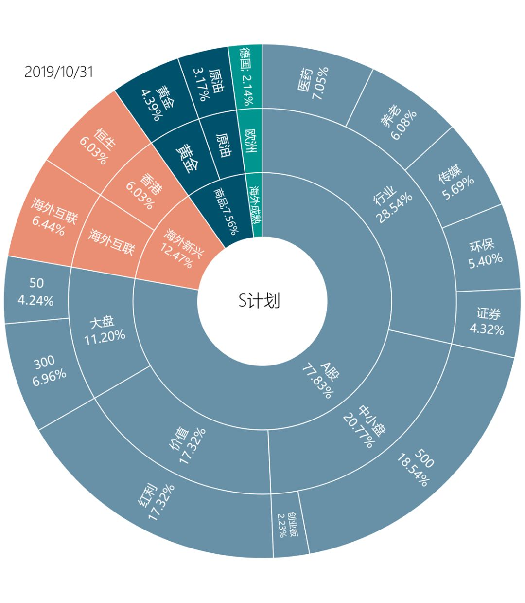

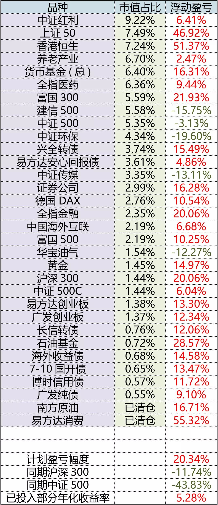

## 12-02

2019-12-02-2019年12月ETF计划（一）：150买入一份，卖出一份；S买入一份

https://mp.weixin.qq.com/s/LfeJQ2QVJSTQypY1sZJ61Q

#### 150计划：

买入建信500一份

（场外000478）

（该品种自目前价格预计最大跌幅25%）

卖出易方达创业板一份

（场内159915-对应场外110026 ）

#### S计划：

S定投专为没有150份资产

只有每月结余的朋友们量身定制

买入易方达安心回报债一份

（场外110027）

（该品种自目前价格预计最大跌幅25%）

（只有每个月结余的朋友

保留一半资金以后再买）

### 150份资产配置&收益率

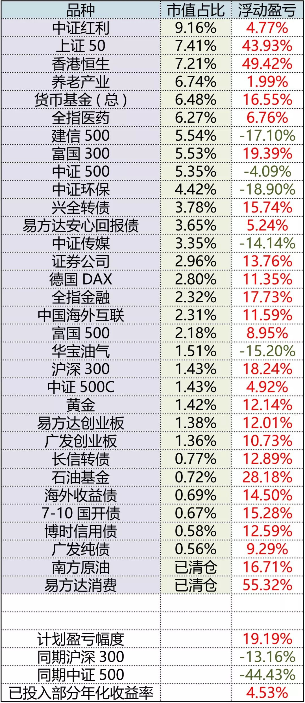

截至目前，第三轮计划领先同期沪深300 32%；领先同期中证500 63%。