# 2020 年长赢计划交易记录

## 2020年1月

### 202001-1
*2019-12-30* - 本次不交易+新年快乐

https://mp.weixin.qq.com/s/l6lftMgATIomy8oFDAtGjA

#### 150份资产配置&收益率

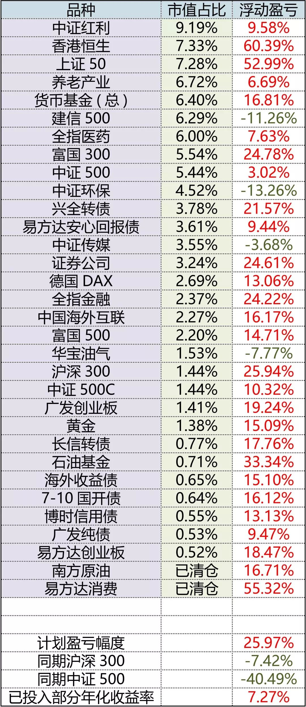

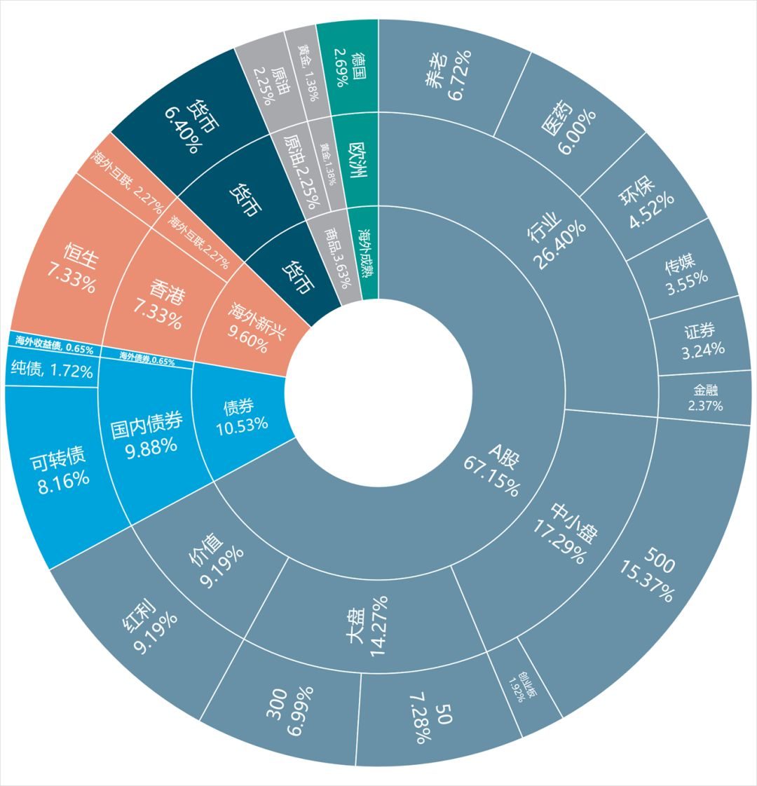

## 2020年2月

### 202002-1

2020-02-04 - 2020年2月ETF计划（一）：150不操作，S买入三份

https://mp.weixin.qq.com/s/1LRP6wqS60SjDlnzZ4-nXQ

#### S定投

S定投专为没有150份资产

只有每月结余的朋友们量身定制

将你的本月可投入资金分为两份，再加上之前

结余的一份：

买入中证红利增强一份

（场外100032）

 （该品种自目前价格预计最大跌幅23%）

买入华宝油气一份

（场内、场外162411）

 （该品种自目前价格预计最大跌幅30%）

买入建信500一份

（场外000478）

（该品种自目前价格预计最大跌幅35%）

#### 150份资产配置

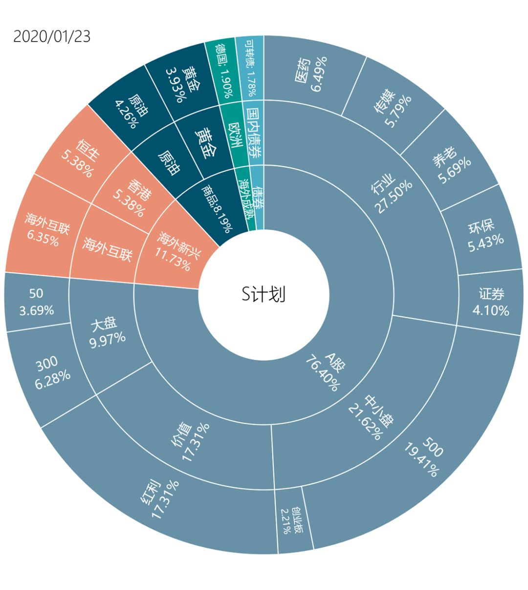

## 2020年3月

### 202003-1

 *2020-02-26* - 2020年3月ETF计划（一） ：150卖出两份，买入一份；S买入一份

https://mp.weixin.qq.com/s/eIkjc08htB_XgKLR3GsQJA

#### 150计划：

买入全指金融一份

（场内159940；场外001469）

 （该品种自目前价格预计最大跌幅40%）

（场内交易不要追高，价格稳定再买）

卖出广发创业板一份

 （场内159952；对应场外003765）

卖出中证500C一份

（场内510510或510500；场外C类002903）

#### S计划：

S定投专为没有150份资产

只有每月结余的朋友们量身定制

买入全指金融一份

（场内159940；场外001469）

 （该品种自目前价格预计最大跌幅40%）

（场内交易不要追高，价格稳定再买）

（只有每个月结余的朋友

保留一半资金以后再买）

#### 150份资产配置

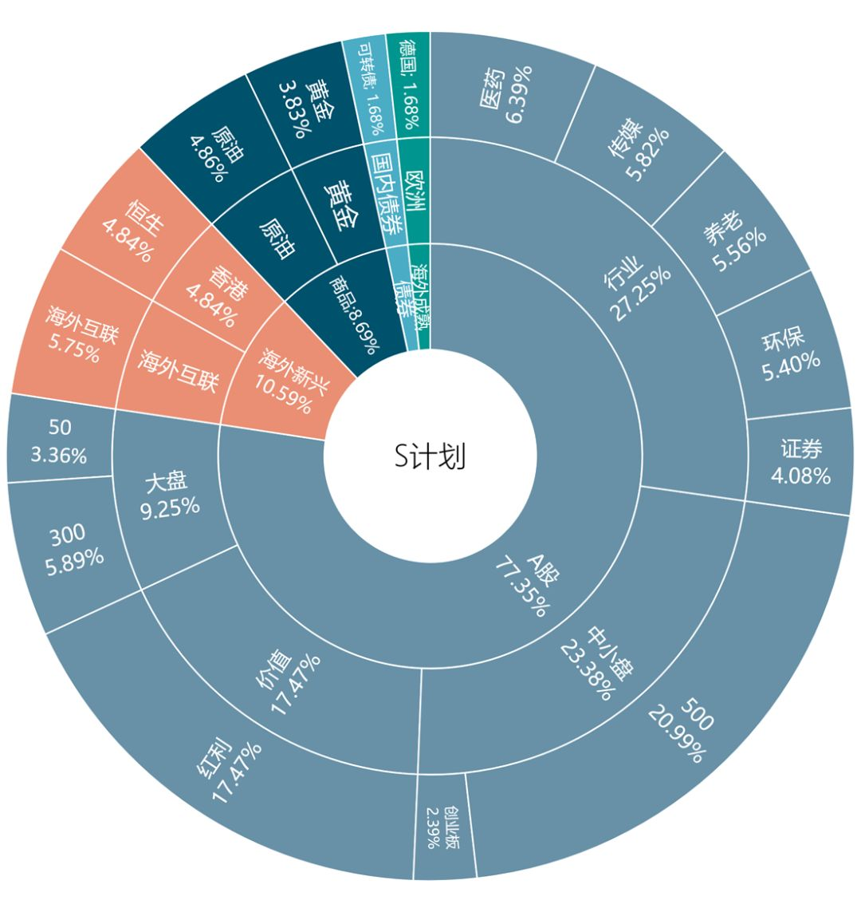

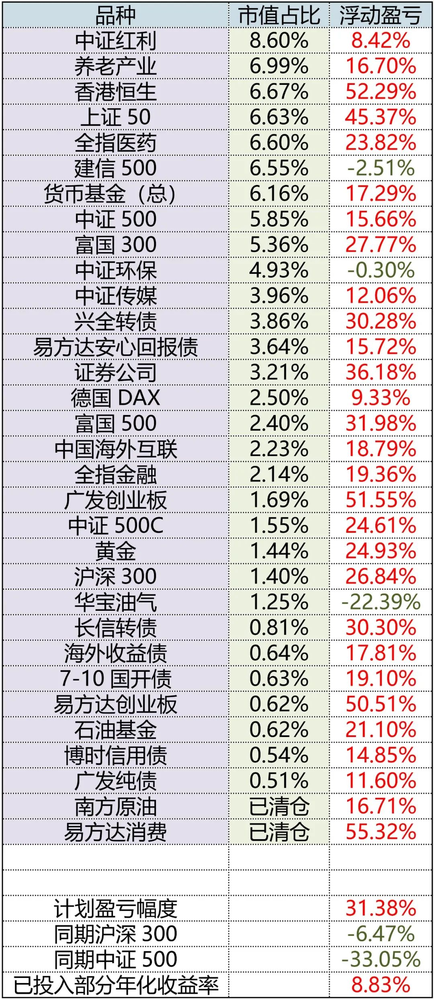

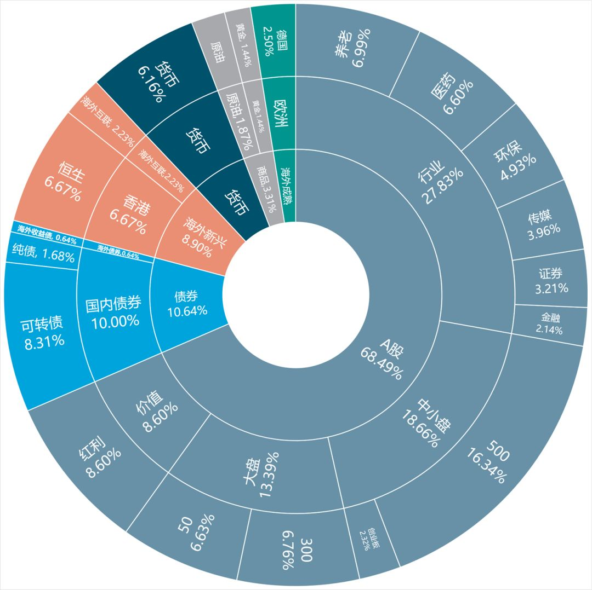

### 202003-2

2020-03-09 【文字发车】
"没有时间写文章排版了，用文字方式发车。以后这种情况会经常出现。
2020年3月ETF计划（二） ：
150卖出两份，买入一份；S卖出两份，买入一份

#### 150计划：

卖出一份易方达创业板（场内159915；对应场外110026 ）；
卖出一份中证传媒（场内512980；对应场外004752）；
买入一份南方原油（场外501018）（该品种最大跌幅40%）

#### S计划：

卖出一份广发创业板（场内159952；对应场外003765）；
卖出一份中证传媒（场内512980；对应场外004752）；
买入一份南方原油（场外501018）（该品种最大跌幅40%）
注意，南方原油不建议场内购买，会有溢价。建议场内申购或者场外申购。
场外申购可在且慢跟车。
场内申购操作方式，以华宝智投举例：普通交易-场内基金-场内申购-501018。目前该基金单日限制大额申购20000元。
注意，目前全球金融环境紧张。心态不稳，已经感觉到不适与焦虑的朋友可以不用买入。舒服最重要，因为不舒服会做蠢事。
今天开始不定期，随时发车。"

### 202003-3

2020-03-10【文字发车】
"继续文字发车。
2020年3月ETF计划（三）
S买入一份。使用本月剩余的另一半资金购入。

#### S计划：

买入一份美国标普500（该品种自目前价格最大跌幅50%）
场内品种：不建议。因溢价高或流动性差
场外品种：
博时标普500：050025 （单日申购上限1万元）
或
易方达标普500：161125（单日申购上限2万元）
全球市场波动继续加大，现金流有问题或者未来生活支出积累不够的朋友，需要谨慎投资。"

### 202003-4

2020-03-11【文字发车】 
"连续第三天文字发车。
2020年3月ETF计划（四） 150卖出一份；买入一份。

#### 150计划：

卖出一份华夏海外收益债券A（001061）。
买入一份德国DAX30（该品种自目前价格最大跌幅30%）
场内品种：不建议。因溢价高
场外品种：
华安德国30(DAX)联接：000614 （单日申购上限3000万元）
全球市场波动继续加大，现金流有问题或者未来生活支出积累不够的朋友，需要谨慎投资。"

### 202003-5

2020-03-12 【文字发车】 
"连续第四天文字发车。
2020年3月ETF计划（五）150卖出一份

#### 150计划：

卖出一份广发创业板
（场内159952 -对应场外003765）
本次卖出估值很高的创业板指数，旨在为未来可能出现的其它极好投资机会做出资金储备。
全球市场波动继续加大，现金流有问题或者未来生活支出积累不够的朋友，需要谨慎投资。"

### 202003-6

*2020-03-13* -  2020年3月ETF计划（六） ：150买入两份，卖出一份；S买入两份，卖出一份

https://mp.weixin.qq.com/s/imNxENhGgPTSqabUUjGuwQ

#### 150份

买入恒生指数一份

（场内159920-对应场外000071）

 （该品种自目前价格预计最大跌幅28%）

买入德国DAX30一份

（场内：不建议，因溢价高；场外000614）

 （该品种自目前价格预计最大跌幅25%）

卖出黄金一份

 （场内518880-对应场外000216）

#### S计划

S定投专为没有150份资产

只有每月结余的朋友们量身定制

买入恒生指数一份

（场内159920-对应场外000071）

 （该品种自目前价格预计最大跌幅28%）

买入德国DAX30一份

（场内：不建议，因溢价高；对应场外000614）

 （该品种自目前价格预计最大跌幅25%）

卖出黄金一份

 （场内518880-对应场外000216）

（本次发车使用之前结余资金，

如没有，可不买）

#### 150份资产配置

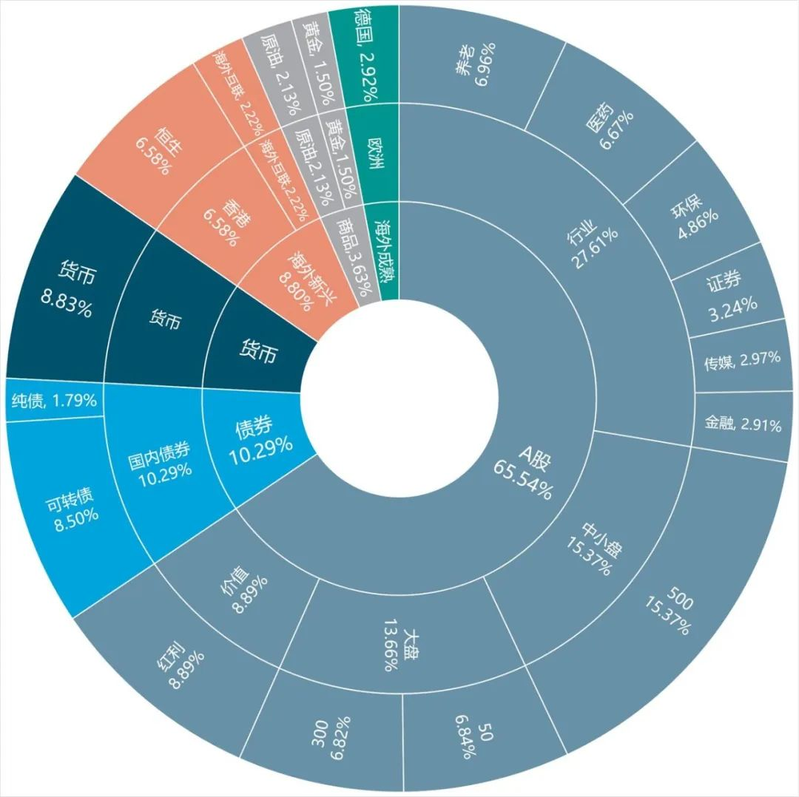

### 202003-7

2020-03-19【文字发车】 
"继续文字发车。之前几个月不发车，等的就是最近这样的节奏。
时隔四年后，我们终于再次加仓恒生指数。这份耐心，有谁能比？
2020年3月ETF计划（七） ：

#### 150份

150卖出两份，买入两份；S买入一份
150计划：
卖出一份7-10国开债（场外003376）；
卖出一份长信可转债（场外519977）；
买入一份恒生指数（场内159920；对应场外000071）（该品种最大跌幅25%）；
买入一份标普500（场外050025）（该品种最大跌幅45%）

#### S计划

买入一份恒生指数（场内159920；对应场外000071）（该品种最大跌幅25%）
全球市场波动继续加大，现金流有问题或者未来生活支出积累不够的朋友，需要谨慎投资。"

### 202003-8

2020-03-25 【文字发车】
"继续文字发车。
2020年3月ETF计划（八） ： 

#### 150份

150卖出广发医药一份（场内159938或场外001180）
（没有买入2018年10月15日那一份的朋友可以不必卖出）
全球市场波动继续加大，现金流有问题或者未来生活支出积累不够的朋友，需要谨慎投资。"

## 2020年4月

没有操作

## 2020年5月

### 202005-1

*2020-04-30* - 150买入一份，卖出一份；S买入一份

https://mp.weixin.qq.com/s/NHrXZSceR-3xEs2A09VT0Q

#### 150份

买入中证红利增强一份

（场外100032）

 （该品种自目前价格预计最大跌幅25%）

卖出广发医药一份

（场内159938或场外001180）

#### **S定投**

S定投专为没有150份资产

只有每月结余的朋友们量身定制

买入全指金融一份

（场内159940；场外001469）

 （该品种自目前价格预计最大跌幅35%）

（场内交易不要追高，价格稳定再买）

（只有每个月结余的朋友

保留一半资金以后再买）

#### 150份资产配置&收益率

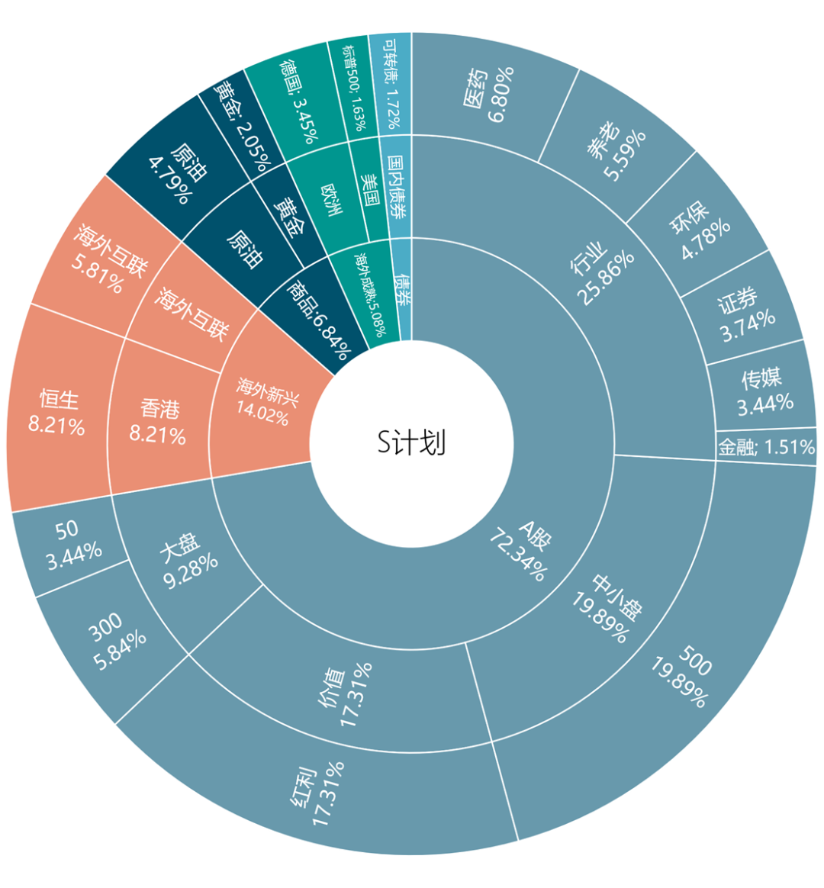

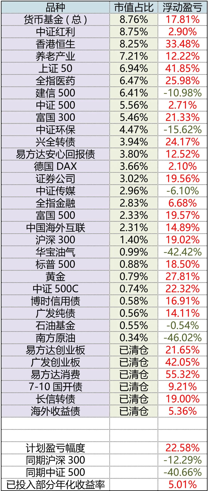

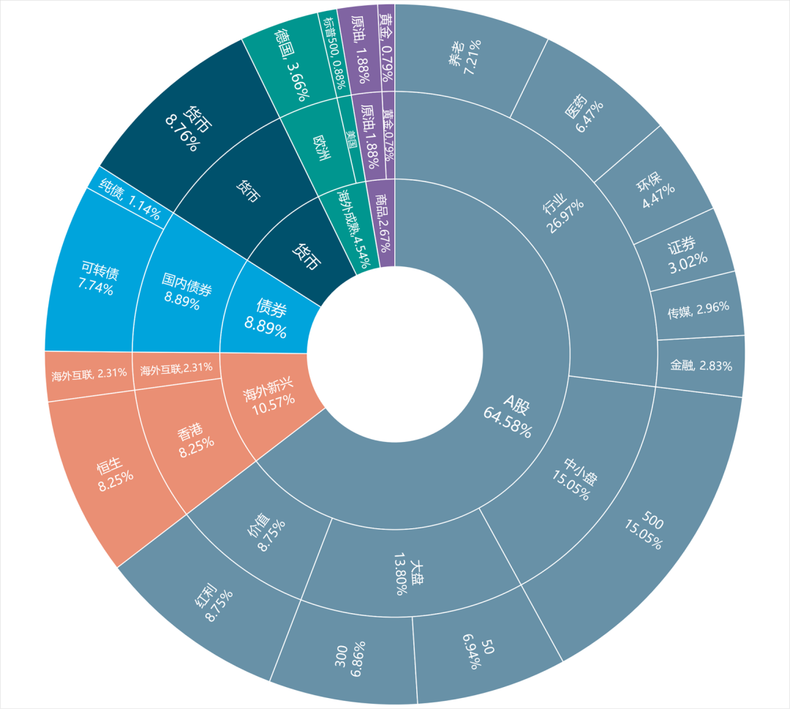

### 202005-2

2020-05-18 - 150卖出两份

https://mp.weixin.qq.com/s/KhXN98CDxoZtAxVeAkF_FA

2020年5月ETF计划（二）：150卖出两份 时间不够，文字发车：

#### 150份

卖出两份： 

卖出美国标普500一份（场外050025） 

卖出广发纯债一份（场外270048） 

**请各位注意**

我们调仓卖出并不意味着品种后市一定不会继续涨，就像我们买入不意味着一定不会继续跌。

比如这次卖出的标普500，我们买入后又跌了一天才见底。 

但是做生意的道理，低买高卖总是没错的。

## 2020年6月

### 202006-1

*2020-06-09*  - 150卖出一份；S不操作

https://mp.weixin.qq.com/s/T_g7Br6WF8Jgq3edcDbv9w

#### 150份

卖出中国海外互联一份

（场内513050或场外164906）

#### 150份资产配置&收益率

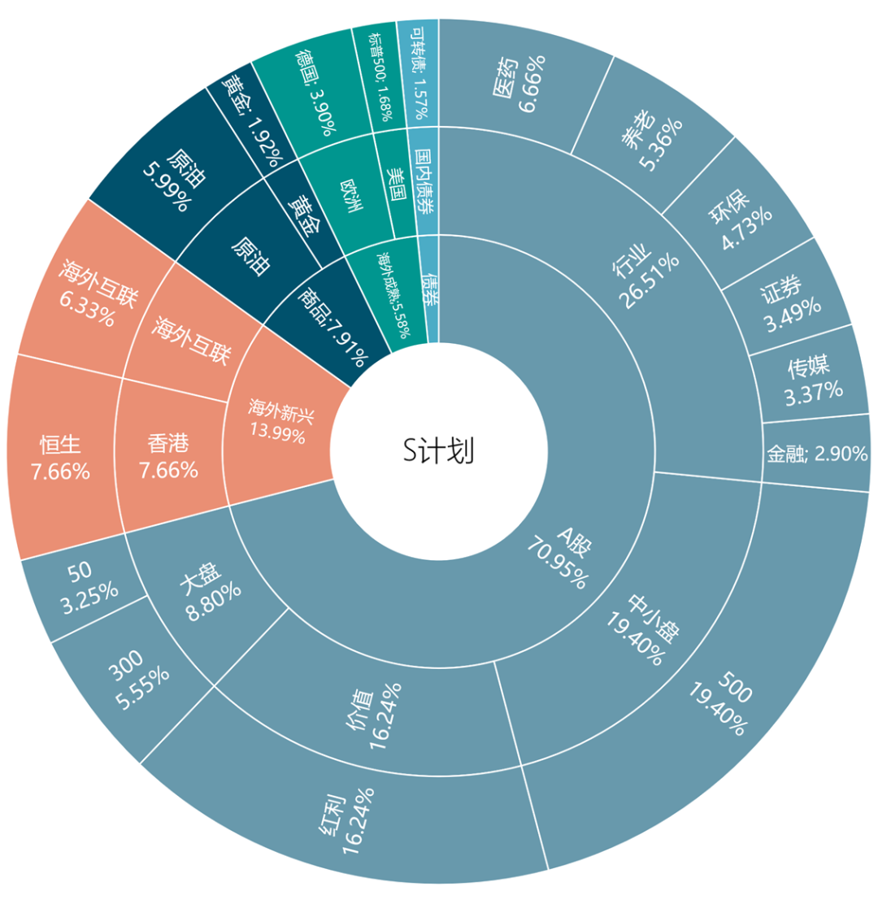

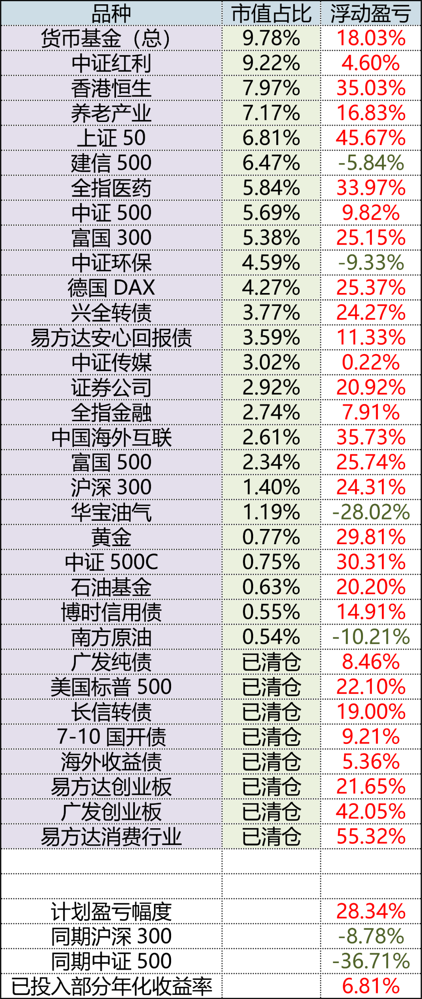

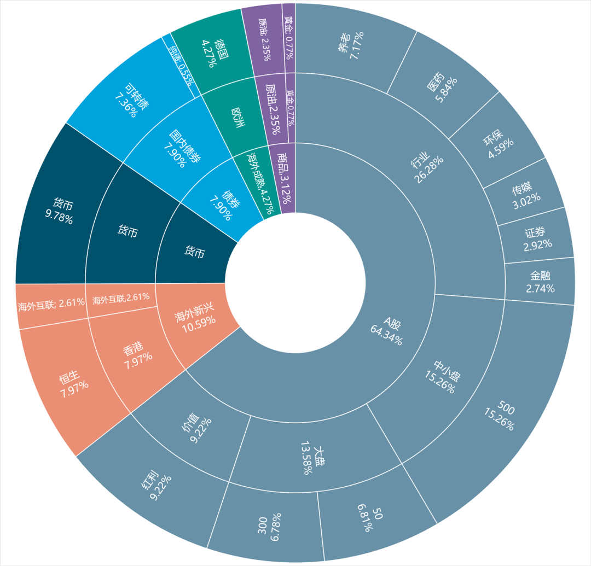

## 202006-2

[2020-06-24-2020年6月ETF计划（一）：150卖出一份、买入一份；S卖出一份](https://mp.weixin.qq.com/s/ZE8rPooJv61QdaZkiJtxcQ)

## 2020年7月

## 202007-2

[2020-07-10-2020年7月ETF计划（二）：150卖出一份](https://mp.weixin.qq.com/s/V8O1C1hth4wU_nX2uJDSPQ)

时间不够，文字发车： 150卖出一份 卖出全指医药一份（场内159938；场外001180）  距离150上次卖出医药又涨了30%。所以你应该知道我卖不到最高点。我没这个能力，也没这个志向。那么今天的卖出你可以参考，也可以自己决定继续持有。丰俭由人。 卖出后医药依然持仓7份，浮动收益率62%。看看你的交易记录，想想交易时候的心情和想法，相信会有很多感悟和进步。 涨涨跌跌，赚了赔了，就这么点事儿，一起慢慢成长吧。

## 202007-3

[2020-07-16-2020年7月ETF计划（三）：150卖出三份；S卖出三份](https://mp.weixin.qq.com/s/6-2Z6f565uXTza5Mmf52_A)

## 2020年8月

## 202008-1

[2020-08-12-2020年8月ETF计划（一）：](https://mp.weixin.qq.com/s/X2F6CpXWKcWyZ2TTNMe6gw)

## 2020年9月

### 202009-1

2020-09-11-ETF计划（一）：150买入一份

https://mp.weixin.qq.com/s/0Ne8f__5oe7CHpXJC4xang

时间不够，文字发车：

#### 150

买入一份

买入南方通利A一份（场外000563）

简要说明：

目前A股除了部分板块泡沫非常严重，整体并不算贵。然而我们的A股仓位已经不小，所以这个区间不会再继续加仓。债券经过6个月的调整，虽说并没有特别大的投资价值，却有了一定的配置意义。由于我们的配置中只有不到1%的纯债仓位，买入一份纯债基就非常合理了。

仓位中加入债券基金并不能让你资产一飞冲天，但能在大多数时候帮你平衡波动。并非适合每个人，但适合大多数人配置。你可以根据自己的情况取舍。

毕竟我们不懂投资，只能做点资产配置才能维持的了生活这样子。

### 202009-2

2020-09-11-ETF计划（二）：2020年9月ETF计划（二）：

https://mp.weixin.qq.com/s/0Ne8f__5oe7CHpXJC4xang

#### 150

卖出两份：

卖出养老产业一份（场外000968）

卖出全指医药一份（场内159938；场外001180）

两个指数跌到了触发卖出规则的区域，所以今天卖出两份。

与买入一样，卖出也分左侧和右侧。左侧就是你有各种理由觉得它“贵”了所以卖出。而右侧意味着那你有各种理由认为它的“趋势”变化了。

如果你有一定投资经验，就会发现左侧和右侧都不是完美的。贵了可能更贵，而趋势变化也可能是假的。世界上当然没有一种完美的卖出方式，否则，所有人都会用它。这次卖出也未必是“对”的。可能今天卖了，下周就大反弹。这些没法控制，我只知道到了自己设定的条件就照做。仅此而已。

## 2020年10月

### 202010-1

*2020-10-13*

#### 150份

买入易方达高等级债券一份
（场外000147）

（该品种自目前价格预计最大跌幅25%）

#### 150份资产配置&收益率

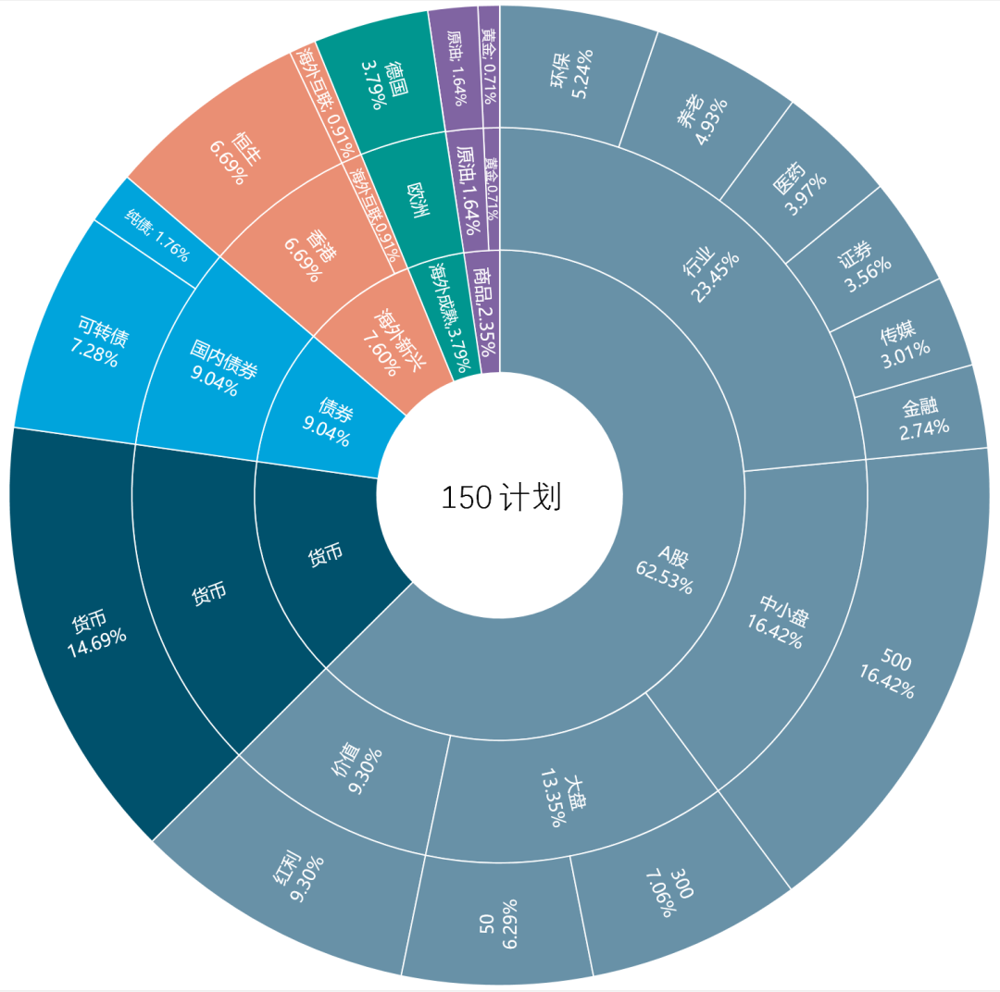

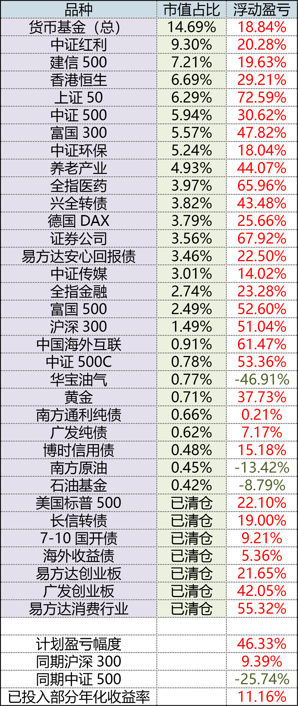

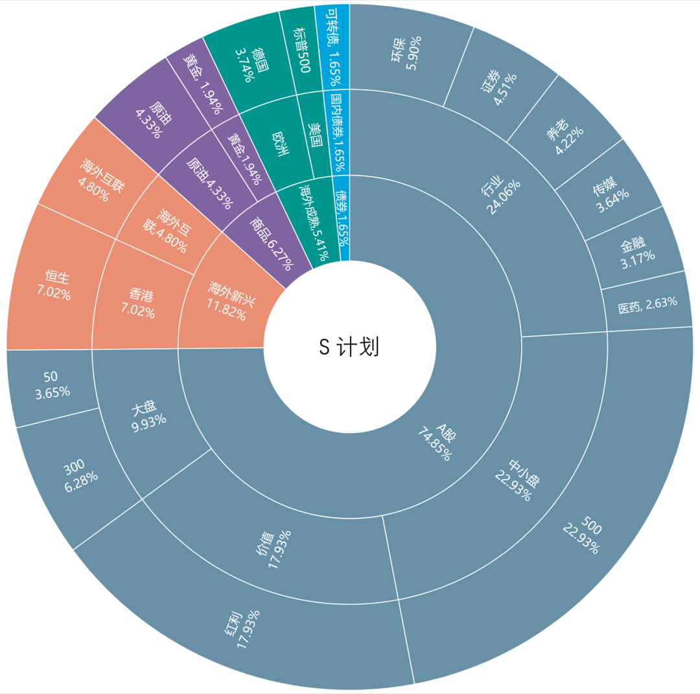

## 2020年11月

### 202011-1

#### 150份

- 买入南方通利A两份

（场外000563）

（该品种自目前价格预计最大跌幅20%）

- 买入恒生指数一份

（场内159920；对应场外000071）

（该品种自目前价格预计最大跌幅40%）

#### S定投

买入恒生指数一份

（场内159920；对应场外000071）

（该品种自目前价格预计最大跌幅40%）

只有每个月结余的朋友,保留一半资金以后再买）

#### 150份资产配置&收益率

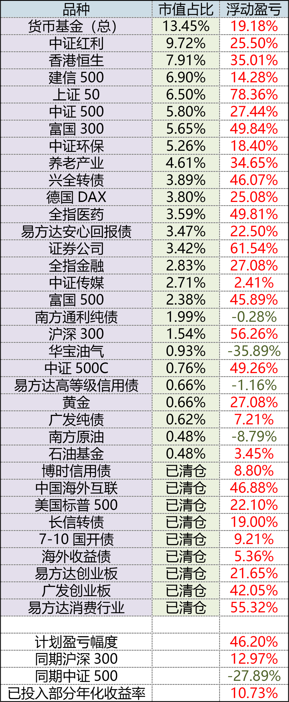

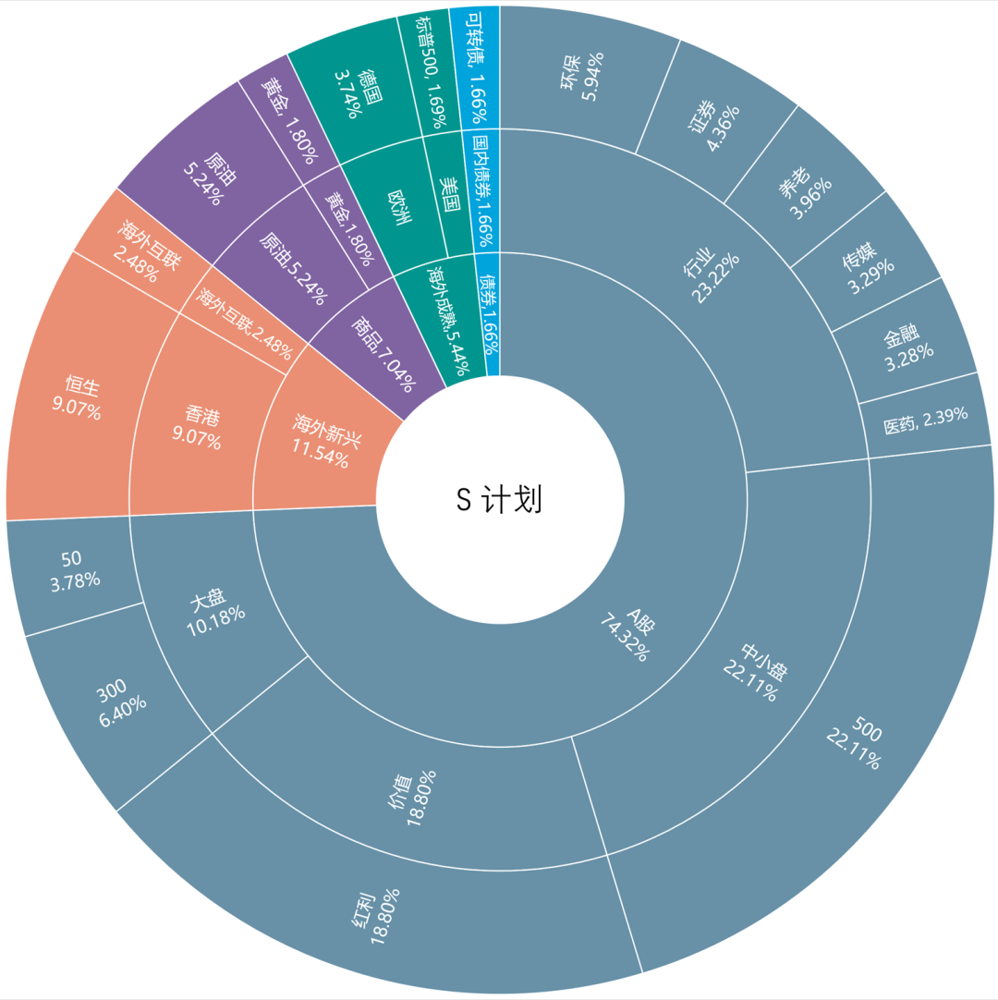

到目前为止，还没有买入的往期计划

50ETF     （510050）一份  （价格不超过2.117（分红调整价格）、2016年8月计划）

食品饮料  （160222）一份 （对应国证食品饮料399396不超过8000点、2016年10月计划）

180ETF   （510180）一份  （价格不超过2.84、2016年10月计划）

### 202011-2

2020-11-11

#### 150计划

卖出中国海外互联一份（场内513050或场外164906）

#### S计划

卖出中国海外互联一份（场内513050或场外164906）

两个计划本次卖出的一份海外互联收益率都已经超过70%，选择落袋为安。

希望有机会买回来。整体来说，海外互联作为我们科技配置中不可或缺的一部分，依然是非常重要的。

如果非常喜欢，依然可以不卖，无伤大雅。只要能够低买高卖，总归不会错的太离谱。

祝大家今天也开心。

### 202011-3

2020-11-13

#### 150计划

卖出博时债一份（场外050027）

这份博时债持有几年了，收益率20%多。期间分红不断，我们大多数时间都选择了现金分红，所以其实持有的仓位已经很小了。

最近债市波动，相信有朋友会比较担心我们持仓的3个多点债券基金会不会出问题（今天卖出后2个多点）。

目前我们持有的债基，大部分持仓是国债、国开债等利率债，以及城投债、农发债等。信用债有一部分，等级都较高，几个重点省份的极少。

后续会持续关注债券的问题，各位不必过于担心。如果实在担心的，自己赎回也可以。但是注意，今年买的3、4份，持有不到一年赎回费会比较高。

周末要开心啊！

## 2020年12月

### 202012-1

#### 150份

本次不操作

#### S定投

S定投专为没有150份资产

只有每月结余的朋友们量身定制

买入大摩健康产业一份

（场外002708）

（该品种自目前价格预计最大跌幅60%）

（只有每个月结余的朋友

保留一半资金以后再买）

#### 150份资产配置&收益率

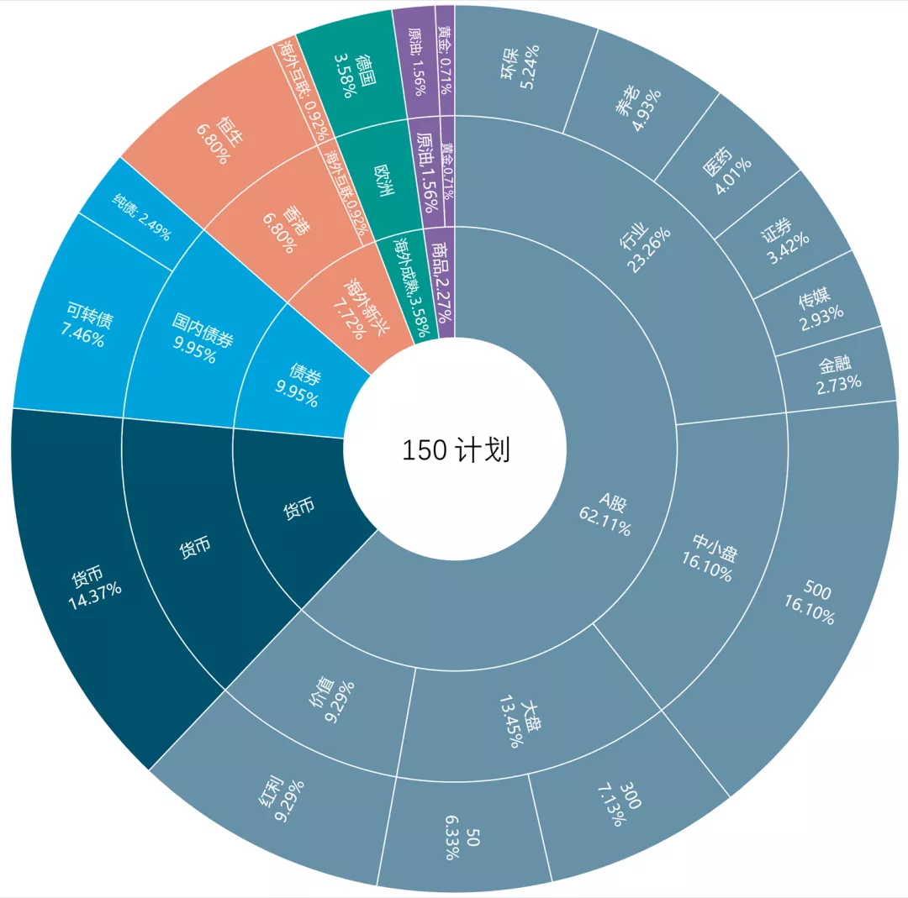

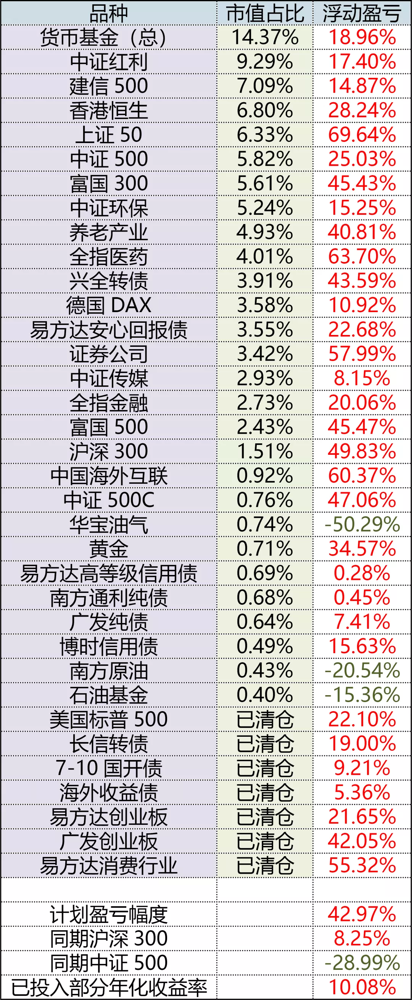

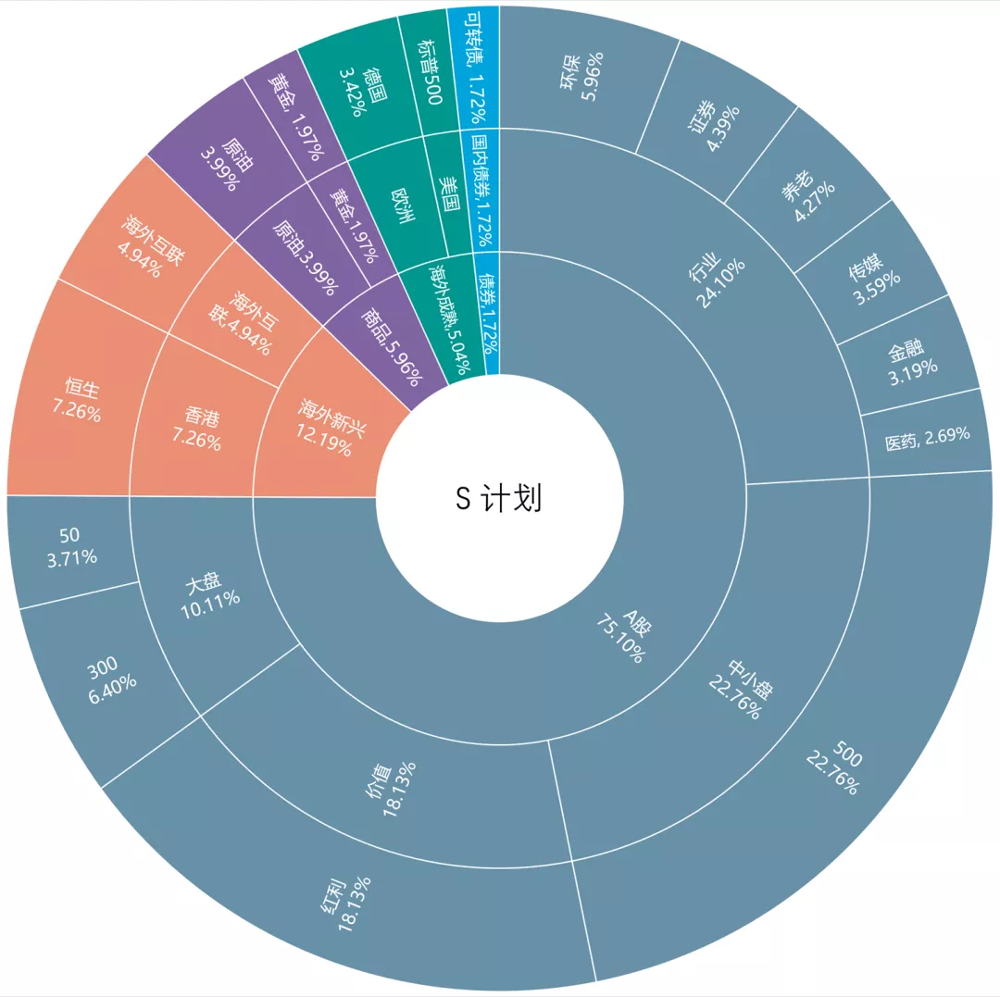

150计划领先同期沪深300指数幅度为33%；领先同期中证500指数幅度为74%。

---

### 202012-2

#### 150份

- 买入7-10国开债一份

  （场外003376）（该品种自目前价格预计最大跌幅40%）

  

- 卖出上证50一份

  （场内510050或场外001051）

  

本次卖出的一份上证50收益率已经超过70%，选择实现利润。份数不够的朋友可以不卖。

---

### 202012-3

150计划：

卖出一份中证环保：（场内512580；场外001064）

买入一份7-10国开债：（场外003376——该品种自目前价格预计最大跌幅40%）

今年，尤其是下半年开始，环保表现非常出色，全年涨幅也仅次于消费指数。

大多数朋友在环保这个低迷了几年的品种上赚了很多，尤其是2018以及今年补仓的朋友，收益率都在70%以上。

根据卖出原则，今天先减仓一份，做个小的再平衡。

踏踏实实的，多大点事儿，不就赚点钱吗。

