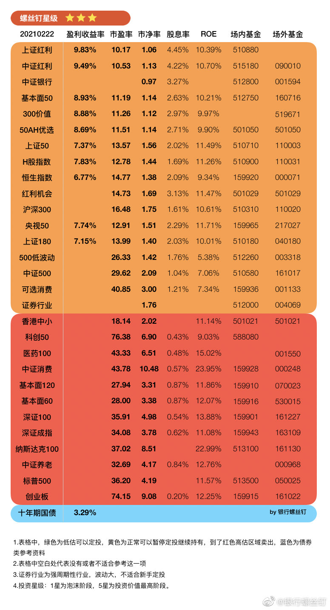

# ［2月22日]第1603期指数估值

今天A股迎来久违的大跌。

白酒指数下跌8.25%，整个行业几乎跌停。下跌之后，今年以来白酒的涨幅也抹去了。
A股整体也是下跌的。

不过也有少数品种上涨。前期低迷的红利、低波动，今天上涨幅度还不错。

其实还是延续了上周的走势。

一些顺周期性品种的保险地产等上涨，含有这些品种比例较高的基金最近收益也还可以。

1. 也有朋友问下跌后有没有出现投资机会。

消费行业整体还是不太便宜的，从珠穆朗玛峰下到珠峰大本营，但还是在青藏高原上。

不过消费也不是所有品种都很贵。部分品种处于正常估值。如果后面这种跌幅延续几周，可能也会跌出机会。
长期看消费仍然是优秀行业的，不用太担心。

像组合也提前做好了准备。

（1）指数组合中含有红利等品种，最近是上涨的；高估品种分批卖出也进行了大半。组合风险并不大。

（2）主动优选组合1月底做了调仓，将部分较贵之后风险较大的品种调低，加入了曹名长等深度价值风格的基金。

深度价值风格，典型的代表是红利、价值等品种，以及曹名长、丘栋荣等主动基金经理。
这些品种是最近比较受益，春节后整体还是上涨的。
组合里也有这些品种。

所以今天指数、主动组合跌幅都比大盘少很多。
钉钉宝365天组合就不用说了，本身债券为主，什么时候波动都不大。

其实我们投资的大多数品种都会等到上涨的阶段到来，只不过要稍有些耐心。
Every dog has its day。

2. 遇到市场大涨之后如何保护好自己的收益，这是很关键的。

有的基金经理会越上涨发越多新基金，结果导致很多投资者买在高位。

有的负责任的基金经理，则会在大涨后限购。

例如主动优选组合中的富国天惠朱少醒和易方达蓝筹张坤。

他们在1月份大涨之后，也对自己的基金进行了更加严格的限购。

例如富国天惠
（1）2020年7月份，限购300万/天
（2）2020年8月份，限购30万/天
（3）2021年2月18日，限购1万/天

张坤的易方达蓝筹也是限购2000元/天。

基金经理觉得市场不便宜，或者觉得自己管理的钱太多管不过来。
就会限购，放弃短期规模，保护投资者收益。
短期涨跌无法避免，但这种做法对投资者还是负责任的。

组合里有基金限购，我们组合整体也会限购，也是额外提供了保护。
螺丝钉也会通过调仓或者高估卖出的方式来进一步减少风险。

我们无法预测短期市场涨跌，但会用各种方法，保护好大家，不会在股票基金上冒太大风险。

我们做的事情也还是跟之前一样：跌出机会就买，涨出机会就卖，其他时间耐心持有享受收益!

